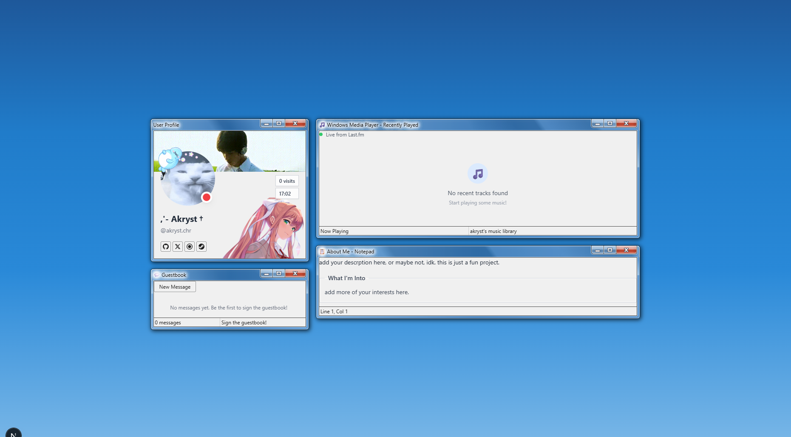

# AeroBio

A personal website with a Windows 7 Aero aesthetic.




---

## Features

| | |
|---|---|
| Profile card | Live Discord status via Lanyard |
| Music widget | Recently played tracks from Last.fm |
| Guestbook | Anonymous messages from visitors |
| About | A section about me |
| Visitor counter | Tracks unique visits |

## Setup

```bash
git clone https://github.com/Akryst/akryst.git
cd akryst
npm install
cp .env.example .env
npx prisma generate
npx prisma db push
npm run dev
```

## Environment Variables

```env
DATABASE_URL="file:./dev.db"
ADMIN_SECRET=your-secret-here
NEXT_PUBLIC_LASTFM_API_KEY=your-lastfm-api-key
NEXT_PUBLIC_LASTFM_USERNAME=your-lastfm-username
NEXT_PUBLIC_DISCORD_ID=your-discord-id
```

- **Last.fm API key** — [last.fm/api/account/create](https://www.last.fm/api/account/create)
- **Discord ID** — Developer mode > right-click profile > Copy ID
- **Admin secret** — Any random string, used to manage the guestbook

## Admin Mode

Append `?admin=YOUR_SECRET` to the URL to enable guestbook moderation.

## Deployment

```bash
npm run build
npm start
# or
pm2 start ecosystem.config.js
```

## Credits

- [7.css](https://github.com/nicepkg/7.css) — Windows 7 UI kit
- [Lanyard](https://github.com/Phineas/lanyard) — Discord rich presence API
- [Last.fm API](https://www.last.fm/api) — Music scrobbling data
- [schuh.wtf](https://schuh.wtf/) — Inspo for vibes and design

---

MIT License